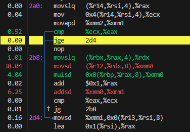
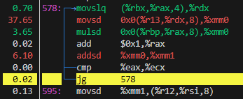
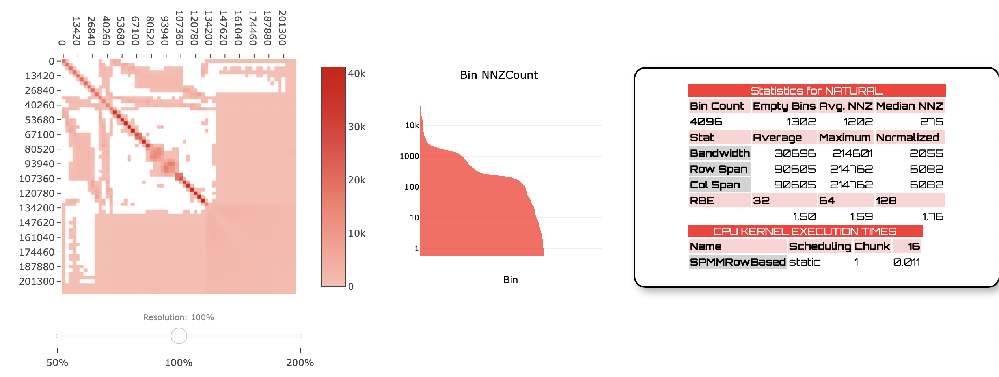
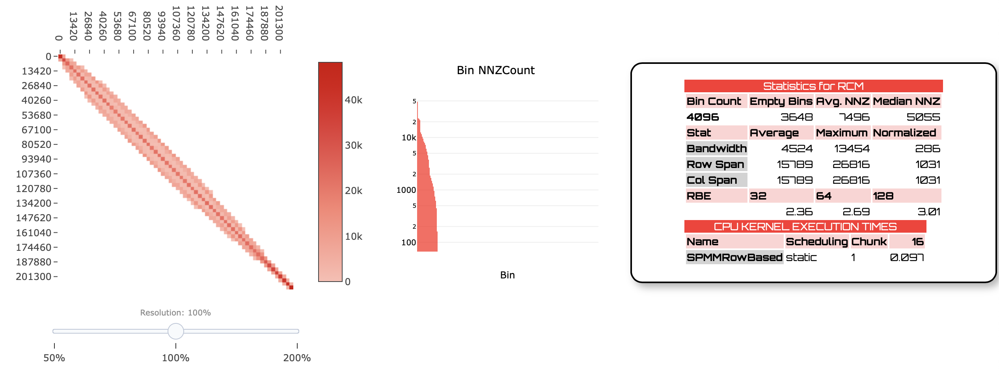

# CS406 HW1 Report Kadir Yağız Ebil

## Introduction

Objective: Optimize the performance of Sparse Matrix-Vector Multiplication (SpMV)
* Learn temporal locality, spatial locality.
* Modify the matrix/vector structures such that when the same SpMV routine runs, it produces the same result but faster.


## Compressed Sparse Row (CSR) Format

CSR uses three arrays to store non-zero elements **efficently**.
* row_ptrs: Holds index position of values and col_ids arrays that the NNZ of the current row stars.
* col_ids: Stores the column index of NNZ.
* values: Stores the values of NNZ.

## Perf Tools Before Optimization

Existing code compiled using optimization flag: g++ hw1.cpp -O3

### Perf Stat 
Perf Stat Command used for searching possible bottlenecks.

Matrix is read from binary file:
    Number of rows/columns: 10000000
    Number of nonzeros: 109999970

Time taken for the original SpMV over 10 iterations: 14.7331 seconds
Original statistics: -8.87823e+49 2.07568e+46 -1.95317e+51

Time taken for the modified SpMV over 10 iterations: 14.6297 seconds
With optimization statistics: -8.87823e+49 2.07568e+46 -1.95317e+51

 Performance counter stats for './a.out':

         30,494.02 msec task-clock                #    1.000 CPUs utilized          
                26      context-switches          #    0.001 K/sec                  
                 0      cpu-migrations            #    0.000 K/sec                  
           371,737      page-faults               #    0.012 M/sec                  
    83,710,890,343      cycles                    #    2.745 GHz                    
    21,206,535,670      instructions              #    0.25  insn per cycle         
     3,424,627,263      branches                  #  112.305 M/sec                  
         1,063,621      branch-misses             #    0.03% of all branches        

      30.495098180 seconds time elapsed

      29.070455000 seconds user
       1.423924000 seconds sys

Using these results, one can understand that there is a probable **memory bottleneck**. The reasoning behind this is, low number of insn per cycle. 83 billion cycles used but only 21 billion instructions taked place. This means by **%75 of the cycles wasted waiting for data from the memory**.

### Cache Miss Problem

For further analysis. By combining cache miss rates with CPU cycle and instruction statistics, one can get a clearer picture of where bottlenecks lie, and whether **cache optimization techniques** (like matrix reordering or prefetching) might be effective. 

 Performance counter stats for './a.out':

     2,250,798,175      cache-misses              #   65.322 % of all cache refs    
     3,445,720,413      cache-references                                            
     7,955,803,842      L1-dcache-loads                                             
     4,297,666,720      L1-dcache-load-misses     #   54.02% of all L1-dcache hits  

      27.998642444 seconds time elapsed

      26.521643000 seconds user
       1.476091000 seconds sys

As expected, **cache miss rate is around %65**. Which is pretty high and states that CPU has problems retrieveing data from cache. Needs to use slower RAM for necessary data frequently.

High miss rates, makes one to believe there might be **poor cache locality**. Sparse matrix operations generally have tendency to this result because of **indirect and irregular memory access**.

### Perf Record

For further analysis of bottleneck, perf record-perf report command was initialized.

Movsd (move scalar double-precision floating-point value) instruction is the the most time-consuming regions of code.
Movsd, mulsd, addsd, which are part of the matrix-vector multiplication operation (dot products in the inner loop of SpMV).

The fact that this operations are expensive, further improves our idea of **memory bottleneck**, because accessing the operands from memory can take a long time


>movslq and movsd instructions


>movslq and movsd instructions in different region

## Solution Ideas

SpMV opertation is seem to be **memory bounded** as we analized in previous section.

First idea is to gather NNZ elements together to **limit high cache miss**.

### RCM (Reverse Cuthill-McKee) Algorithm

The RCM is a reordering method used to improve **bandwidth** of the matrix.

Bandwidth is in context of Sparse Matrix, refers to **distance between non-zero elements of the matrix** when iterating over rows. Large bandwidth matrix formations usually tend to increase cache misses.

### How RCM Works

RCM reorders the rows and columns of the matrix, so the non-zero elemts are closer to diagonal. This improves **spatial locality**.



>Before the RCM applied 



>After the RCM applied 

### RCM implementation

First we start creating the graph structure for RCM ordering. Each node is represented by an int and the corresponding value is connected nodes vector.

```c++
    unordered_map<int, vector<int>> graph;

    for (int i = 0; i < n; ++i) {
        for (int idx = row_ptrs[i]; idx < row_ptrs[i + 1]; ++idx) {
            int col = col_ids[idx];
            graph[i].push_back(col);  
            graph[col].push_back(i);  // Symmetric for undirected graph
        }
    }
```

This part of the RCM code finds the node with minimum number of connections. Number of connections also refferred as **degree of a node**. 

By the end of the loop, min_degree will hold the smallest degree found in the graph, and start_node will be the identifier of the node with that degree.

```c++
    int min_degree = INT_MAX;
    int start_node = -1;
    for (const auto& entry : graph) {
        if (entry.second.size() < min_degree) {
            min_degree = entry.second.size();
            start_node = entry.first;
        }
    }
```
This part of the code, used a technique called **breadth-first search (BFS)**. The queue is used to store each node so that nodes can be traversed in the BFS manner. 

```c++
    vector<bool> visited(graph.size(), false);
    vector<int> ordering;
    queue<int> q;
    visited[start_node] = true;
    q.push(start_node);

    while (!q.empty()) {
        int node = q.front();
        q.pop();
        ordering.push_back(node);

        vector<int> neighbors = graph[node];
        sort(neighbors.begin(), neighbors.end(), [&](int a, int b) {
            return graph[a].size() < graph[b].size();
        });

        for (int neighbor : neighbors) {
            if (!visited[neighbor]) {
                visited[neighbor] = true;
                q.push(neighbor);
            }
        }
    }
```
This section reverses the order of the nodes. This step is **crucial** for RCM ordering.

```c++
    reverse(ordering.begin(), ordering.end());
```
Unordered map named old_to_new is created to map the old node indices to the new node indices based on the reversed ordering.

```c++
    unordered_map<int, int> old_to_new;
    for (int i = 0; i < n; ++i) {
        old_to_new[ordering[i]] = i;
    }
```
In the last section we return to the CSR format that we previously used. However this time we used **new orders** so the shape of the matrix will be different with this CSR values due to our new ordering.

```c++
    int* new_row_ptrs_rcm = new int[n + 1];
    vector<int> new_col_ids_rcm(nnz);
    vector<double> new_values_rcm(nnz);

    new_row_ptrs_rcm[0] = 0;
    int new_nnz_rcm = 0;
    for (int i = 0; i < n; ++i) {
        int old_row = ordering[i];
        for (int idx = row_ptrs[old_row]; idx < row_ptrs[old_row + 1]; ++idx) {
            int old_col = col_ids[idx];
            int new_col = old_to_new[old_col];
            new_col_ids_rcm[new_nnz_rcm] = new_col;
            new_values_rcm[new_nnz_rcm] = values[idx];
            ++new_nnz_rcm;
        }
        new_row_ptrs_rcm[i + 1] = new_nnz_rcm;
    }
```

Hopefull after RCM, **cache miss** problem will be reduced due to increase in **spatial locality**.

### Perf Stat For Modified(RCM) 

There is the stats for RCM ordered SpMV:

Matrix is read from binary file:
        Number of rows/columns: 10000000
        Number of nonzeros: 109999970

Time taken for the original SpMV over 10 iterations: 13.2501 seconds
Original statistics: -8.87823e+49 2.07568e+46 -1.95317e+51

Applied RCM ordering to the matrix.
Time taken for the modified SpMV over 10 iterations: 1.2458 seconds
With optimization statistics: -8.87823e+49 2.07568e+46 -1.95317e+51

 Performance counter stats for './a.out':

         92,384.07 msec task-clock                #    1.000 CPUs utilized          
               213      context-switches          #    0.002 K/sec                  
                 5      cpu-migrations            #    0.000 K/sec                  
         1,544,647      page-faults               #    0.017 M/sec                  
    266,710,459,471     cycles                    #    2.887 GHz                    
    145,660,379,788     instructions              #    0.55  insn per cycle         
    22,780,235,112      branches                  #  246.582 M/sec                  
       155,845,222      branch-misses             #    0.68% of all branches        

      92.392919170 seconds time elapsed

      88.567350000 seconds user
       3.815972000 seconds sys

As expected, insn per cycle metric now show that we are loseing significantly less time for data accesses. Which decreased our time to 1.2-1.3 secs.

Matrix is read from binary file:
        Number of rows/columns: 10000000
        Number of nonzeros: 109999970

Time taken for the original SpMV over 10 iterations: 15.3155 seconds
Original statistics: -8.87823e+49 2.07568e+46 -1.95317e+51

Applied RCM ordering to the matrix.
Time taken for the modified SpMV over 10 iterations: 1.31391 seconds
With optimization statistics: -8.87823e+49 2.07568e+46 -1.95317e+51

 Performance counter stats for './a.out':

    50,159,033,761      L1-dcache-loads                                             
     4,298,480,994      L1-dcache-load-misses     #    8.57% of all L1-dcache hits  

     100.420498425 seconds time elapsed

      95.390245000 seconds user
       5.023696000 seconds sys

**Cache miss rate** is again incredibly improved according to first mesurements of L1 cache which was around %50.

The RCM applied results showed around %10 L1-cache miss.


## Further Explanation And Ideas 

In this report, successfully, solved a memory bounded problem and implemented a better solution for SpMV. Resulst allign with our hypothesis.

Prefetching was not possbile due to restrictions to modify. New orderings could be found faster using pre-fetch inside RCM section. However it was not necesary because time was only measureing the SpMV part of the code.

There are other orderings for sparse matrix rather then RCM. In the source code there are some implementations for further analysis of this possibilites. However, neither **Block**, **Nested Dissection** or **RABBIT** worked as well as RCM. 

There is a possible development for RCM, which introduces priority queue. **RCM2** shows that implementation of RCM. Which in my case didn't go as planned. Resulted with 2.5 secs which is higher than expected. This may be caused beacuse of lack of implementation and research time.

Kadir Yağız Ebil - 32327