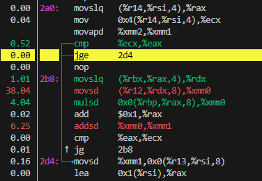
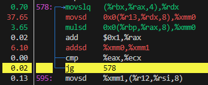

# CS406 HW1 Report

## Introduction

Objective: Optimize the performance of Sparse Matrix-Vector Multiplication (SpMV)
* Learn temporal locality, spatial locality.
* Modify the matrix/vector structures such that when the same SpMV routine runs, it produces the same result but faster.

## Compressed Sparse Row (CSR) Format

CSR uses three arrays to store non-zero elements **efficently**.
* row_ptrs: Holds index position of values and col_ids arrays that the NNZ of the current row stars.
* col_ids: Stores the column index of NNZ.
* values: Stores the values of NNZ.

## Perf Tools Before Optimization

Existing code compiled using: g++ hw1.cpp -O3

### Perf Stat 
Perf Stat Command used for searching possible bottlenecks.

Matrix is read from binary file:
    Number of rows/columns: 10000000
    Number of nonzeros: 109999970

Time taken for the original SpMV over 10 iterations: 14.7331 seconds
Original statistics: -8.87823e+49 2.07568e+46 -1.95317e+51

Time taken for the modified SpMV over 10 iterations: 14.6297 seconds
With optimization statistics: -8.87823e+49 2.07568e+46 -1.95317e+51

 Performance counter stats for './a.out':

         30,494.02 msec task-clock                #    1.000 CPUs utilized          
                26      context-switches          #    0.001 K/sec                  
                 0      cpu-migrations            #    0.000 K/sec                  
           371,737      page-faults               #    0.012 M/sec                  
    83,710,890,343      cycles                    #    2.745 GHz                    
    21,206,535,670      instructions              #    0.25  insn per cycle         
     3,424,627,263      branches                  #  112.305 M/sec                  
         1,063,621      branch-misses             #    0.03% of all branches        

      30.495098180 seconds time elapsed

      29.070455000 seconds user
       1.423924000 seconds sys

Using these results, one can understand that there is a probable **memory bottleneck**. The reasoning behind this is, low number of insn per cycle. 83 billion cycles used but only 21 billion instructions taked place. This means by **%75 of the cycles wasted waiting for data from the memory**.

### Cache Miss Problem

For further analysis. By combining cache miss rates with CPU cycle and instruction statistics, one can get a clearer picture of where bottlenecks lie, and whether **cache optimization techniques** (like matrix reordering or prefetching) might be effective. 

 Performance counter stats for './a.out':

     2,250,798,175      cache-misses              #   65.322 % of all cache refs    
     3,445,720,413      cache-references                                            
     7,955,803,842      L1-dcache-loads                                             
     4,297,666,720      L1-dcache-load-misses     #   54.02% of all L1-dcache hits  

      27.998642444 seconds time elapsed

      26.521643000 seconds user
       1.476091000 seconds sys

As expected, **cache miss rate is around %65**. Which is pretty high and states that CPU has problems retrieveing data from cache. Needs to use slower RAM for necessary data frequently.

High miss rates, makes one to believe there might be **poor cache locality**. Sparse matrix operations generally have tendency to this result because of **indirect and irregular memory access**.

### Perf Record

For further analysis of bottleneck, perf record-perf report command was initialized.

Movsd (move scalar double-precision floating-point value) instruction is the the most time-consuming regions of code.
Movsd, mulsd, addsd, which are part of the matrix-vector multiplication operation (dot products in the inner loop of SpMV).

The fact that this operations are expensive, further improves our idea of **memory bottleneck**, because accessing the operands from memory can take a long time

>movslq and movsd instructions

>movslq and movsd instructions in different region